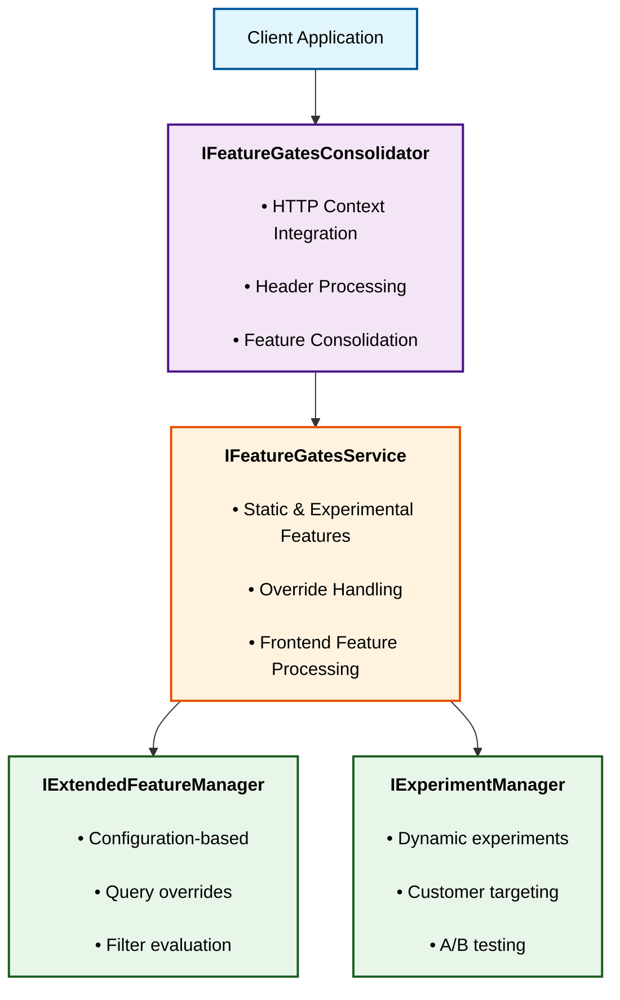

# Feature Management System

## Overview

The Feature Management System is a comprehensive solution for managing feature flags and experiments in .NET applications. It provides a flexible, extensible framework that combines static configuration-based features with dynamic, customer-targeted experiments, enabling sophisticated feature rollout strategies while maintaining simplicity for basic use cases.

Built on top of [Microsoft's Feature Management library](https://github.com/microsoft/FeatureManagement-Dotnet), this system extends the base functionality with additional capabilities including experimental features, HTTP context integration, and advanced filtering options.

## Key Features

- **Feature Flags**: Toggle features on/off without code deployment
- **Gradual Rollouts**: Control feature exposure percentage
- **A/B Testing**: Run experiments with customer targeting
- **Multiple Filter Types**: Time window, percentage, market, campaign, and more
- **Runtime Overrides**: Temporarily enable/disable features via query parameters
- **Frontend Support**: Automatic handling of frontend-specific features
- **Custom Filters**: Extensible filter system for custom logic
- **Comprehensive Observability**: Built-in logging and distributed tracing

## Installation

### Package Installation

```bash
dotnet add package Microsoft.Omex.Extensions.FeatureManagement
```

### Service Registration

```csharp
services.ConfigureFeatureManagement(configuration);
```

### Adding to Codebase

To consume the Feature Management, consume one of the following interface from your codebase:

- [`IFeatureGatesConsolidator`](IFeatureGatesConsolidator.cs) (Higher Level)
- [`IFeatureGatesService`](IFeatureGatesService.cs) (Lower Level)

Both interfaces provide comprehensive documentation.

It is recommended to use `IFeatureGatesConsolidator` where possible to simplify usage.

## Feature Resolution Order

This implementation uses a layered approach to feature resolution, allowing for multiple sources of truth. The order of precedence is as follows:

1. **Query-String Overrides** (Highest Priority)
   - `?features=Feature1;Feature2`: Enable features
   - `?blockedFeatures=Feature3`: Disable features
1. **Experimental Features**
   - Customer-targeted experiments
   - A/B test allocations
1. **Static Configuration** (Lowest Priority)
   - Features defined in `appsettings.json`
   - Default values

### Experimental Features

If you have an experimentation service available, you can make runtime configuration changes to override the static configuration. You will need to inherit from [`IExperimentManager`](Experimentation/IExperimentManager.cs) and pass the class when calling `ConfigureFeatureManagement()`. By default, no experimentation service will be used.

`FeatureOverrideSettings.Disabled` and `FeatureOverrideSettings.Enabled` turn a feature on or off regardless of the filters. If a feature is added to both settings, `FeatureOverrideSettings.Disabled` takes precedence.

`FeatureOverrideSettings.Toggled` allows the enablement of a feature committed as disabled but with the `Toggle` filter present. On activation, this will evaluate the applied filters.

### Static Configuration

Static configuration is defined within `appsettings.json` using the following format:

```JSON
"FeatureManagement": {
  "FeatureA": true,
  "FeatureB": false,
  "FeatureC": {
    "EnabledFor": [
      {
        "Name": "Campaign",
        "Parameters": {
          "Enabled": [
            "Campaign1"
          ]
        }
      }
    ]
  },
}
```

#### Always-On

`FeatureAlwaysOnA` and `FeatureAlwaysOnB` are always-on features, where no filters will be applied:

```JSON
"FeatureAlwaysOnA": {
  "EnabledFor": [
    {
      "Name": "AlwaysOn"
    }
  ]
},
"FeatureAlwaysOnB": true
```

#### Always-Off

`FeatureAlwaysOffA` and `FeatureAlwaysOffB` are always-off features, where no filters will be applied:

```JSON
"FeatureAlwaysOffA": {
  "EnabledFor": []
},
"FeatureAlwaysOffB": false
```

#### Campaign

The campaign filter considers the `campaign` query-string parameter. `Disabled` takes precedence over `Enabled`, so `Campaign2` is disabled in the example below.

```JSON
"FeatureCampaignA": {
  "EnabledFor": [
    {
      "Name": "Campaign",
      "Parameters": {
        "Disabled": [
          "Campaign2"
        ],
        "Enabled": [
          "Campaign1",
          "Campaign2"
        ]
      }
    }
  ]
}
```

#### IP Address

The IP address filter checks the caller's IP address against a predefined range.

```JSON
"FeatureIPAddressA": {
  "EnabledFor": [
    {
      "Name": "IPAddress",
      "Parameters": {
        "AllowedRange": "MYRANGE"
      }
    }
  ]
}
```

No ranges are defined by default. To define a range, inherit from [`IIPRangeProvider`](Filters/Configuration/IIPRangeProvider.cs) and pass the class when calling `ConfigureFeatureManagement()`.

#### Market

The market filter considers the `market` query-string parameter. `Disabled` takes precedence over `Enabled`, so `US` is disabled in the example below.

```JSON
"FeatureMarketA": {
  "EnabledFor": [
    {
      "Name": "Market",
      "Parameters": {
        "Disabled": [
          "US"
        ],
        "Enabled": [
          "US",
          "IE"
        ]
      }
    }
  ]
}
```

#### Rollout

The rollout filter enables a feature for an integer percentage of customers. By default, this will only work if the customer is signed in with an Entra ID, as the sign in credentials will be used to determine the bucket to which they are allocated. This can be overridden for other authentication methods by inheriting from [`ICustomerIdProvider`](Authentication/ICustomerIdProvider.cs)and passing the class when calling `ConfigureFeatureManagement()`.

```JSON
"FeatureRolloutA": {
  "EnabledFor": [
    {
      "Name": "Rollout",
      "Parameters": {
        "ExposurePercentage": 50
      }
    }
  ]
}
```

#### Percentage

The percentage filter is [provided by the library](https://github.com/microsoft/FeatureManagement-Dotnet/blob/main/src/Microsoft.FeatureManagement/FeatureFilters/PercentageFilter.cs).

```JSON
"FeaturePercentageA": {
  "EnabledFor": [
    {
      "Name": "Percentage",
      "Parameters": {
        "Value": 50
      }
    }
  ]
}
```

#### Time Window

The time window filter is [provided by the library](https://github.com/microsoft/FeatureManagement-Dotnet/blob/main/src/Microsoft.FeatureManagement/FeatureFilters/TimeWindowFilter.cs).

```JSON
"FeatureTimeWindowA": {
  "EnabledFor": [
    {
      "Name": "TimeWindow",
      "Parameters": {
        "Start": "2020-01-01T00:00:00Z",
        "End": "2021-01-01T00:00:00Z"
      }
    }
  ]
}
```

Additional settings are available, which can be examined [within the library](https://github.com/microsoft/FeatureManagement-Dotnet/blob/main/src/Microsoft.FeatureManagement/FeatureFilters/TimeWindowFilterSettings.cs).

#### Composite

The codebase provides two filters that facilitate the combination of multiple filters: `ParentFilter` and `ToggleFilter`.

##### Parent

The parent filter allows a feature to inherit the enablement status of another feature. This is useful for creating hierarchical feature structures.

An example of the filter is shown below, although this example does not make sense in production as it creates `FeatureParentA` that is just identical to `ParentFeature`.

```JSON
"FeatureParentA": {
  "EnabledFor": [
    {
      "Name": "Parent",
      "Parameters": {
        "Feature": "ParentFeature"
      }
    }
  ]
}
```

##### Toggle

The toggle filter switches the status of a feature. The concept is to disable the feature by default and to use your experimentation service to enable it at runtime, as documented in [Experimental Features](#experimental-features). Enabling can also be performed using the `toggledFeatures` query-string parameter, which is a semicolon-separated list of features to toggle. The concept is to allow a feature to be enabled while retaining all other config logic, i.e., it doesn't force a feature on but just enables the feature.

```JSON
"FeatureToggleA": {
  "EnabledFor": [
    {
      "Name": "Toggle"
    }
  ]
}
```

##### Combining Filters

The filters can be combined using a `RequirementType` property, which can be set to either `All` or `Any`. The default, if none is specified, is `Any`.

`FeatureCombiningA` is enabled if both `ParentFeature` is enabled and the market is `US`.

```JSON
"FeatureCombiningA": {
  "RequirementType": "All",
  "EnabledFor": [
    {
      "Name": "Parent",
      "Parameters": {
        "Feature": "ParentFeature"
      }
    },
    {
      "Name": "Market",
      "Parameters": {
        "Enabled": [
          "US"
        ]
      }
    }
  ]
}
```

`FeatureCombiningB` is enabled if `ParentFeature` is disabled.

```JSON
"FeatureCombiningB": {
  "RequirementType": "All",
  "EnabledFor": [
    {
      "Name": "Parent",
      "Parameters": {
        "Feature": "ParentFeature"
      }
    },
    {
      "Name": "Toggle"
    }
  ]
}
```

`FeatureCombiningC` is enabled if either the campaign is `Campaign1` or the market is `US`.

```JSON
"FeatureCombiningC": {
  "RequirementType": "Any",
  "EnabledFor": [
    {
      "Name": "Campaign",
      "Parameters": {
        "Enabled": [
          "Campaign1"
        ]
      }
    },
    {
      "Name": "Market",
      "Parameters": {
        "Enabled": [
          "US"
        ]
      }
    }
  ]
}
```

#### Custom Filters

The framework's extensibility allows for the creation of custom filters that can be applied to features.

Custom filters implement the [`IFeatureFilter`](https://github.com/microsoft/FeatureManagement-Dotnet/blob/main/src/Microsoft.FeatureManagement/IFeatureFilter.cs) interface. [`FeatureFilterEvaluationContext`](https://github.com/microsoft/FeatureManagement-Dotnet/blob/main/src/Microsoft.FeatureManagement/FeatureFilterEvaluationContext.cs) is passed to the filter by the framework, which is based on the `IConfiguration` system and allows mapping the filter config to the filter's settings type.

[`MarketFilter`](Filters/MarketFilter.cs) is an example that enables the feature if the provided market value is among the configured markets. [`MarketFilterSettings`](Filters/Settings/MarketFilterSettings.cs) is the filter settings type that matches the parameters of the filter config.

## Architecture



## Additional Resources

- [Microsoft Feature Management Documentation](https://docs.microsoft.com/azure/azure-app-configuration/use-feature-flags-dotnet-core)
- [Feature Flag Best Practices](https://docs.microsoft.com/azure/azure-app-configuration/concept-feature-management)
- [A/B Testing Guide](https://docs.microsoft.com/azure/azure-app-configuration/concept-experimentation)
